# [📈 Live Status](https://merchantsbonding.com): <!--live status--> **🟩 All systems operational**

This repository contains the open-source uptime monitor and status page for [Upptime](https://upptime.js.org), powered by [Upptime](https://github.com/upptime/upptime).

With [Upptime](https://upptime.js.org), you can get your own unlimited and free uptime monitor and status page, powered entirely by a GitHub repository. We use [Issues](https://github.com/upptime/upptime/issues) as incident reports, [Actions](https://github.com/MerchantsBonding/upptime/actions) as uptime monitors, and [Pages](https://merchantsbonding.com) for the status page.

<!--start: status pages-->
<!-- This summary is generated by Upptime (https://github.com/upptime/upptime) -->
<!-- Do not edit this manually, your changes will be overwritten -->
<!-- prettier-ignore -->
| URL | Status | History | Response Time | Uptime |
| --- | ------ | ------- | ------------- | ------ |
|  [API](https://api.merchantsbonding.com/up) | 🟩 Up | [api.yml](https://github.com/MerchantsBonding/upptime/commits/HEAD/history/api.yml) | 

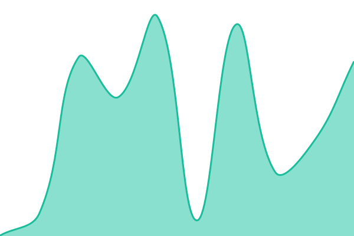 317ms
     
 | 

<a href="https://MerchantsBonding.github.io/upptime/history/api">92.63%</a>
    

|  [Beancounter](https://beancounter.merchantsbonding.com/up) | 🟩 Up | [beancounter.yml](https://github.com/MerchantsBonding/upptime/commits/HEAD/history/beancounter.yml) | 

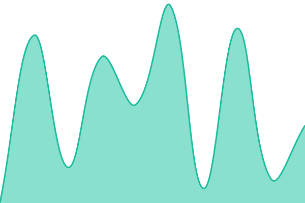 422ms
     
 | 

<a href="https://MerchantsBonding.github.io/upptime/history/beancounter">92.63%</a>
    

|  [Commish](https://commish.merchantsbonding.com/up) | 🟩 Up | [commish.yml](https://github.com/MerchantsBonding/upptime/commits/HEAD/history/commish.yml) | 

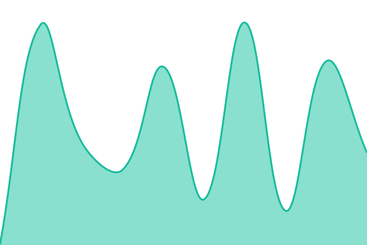 323ms
     
 | 

<a href="https://MerchantsBonding.github.io/upptime/history/commish">92.63%</a>
    

|  [Contract Rating](https://rates.merchantsbonding.com/up) | 🟩 Up | [contract-rating.yml](https://github.com/MerchantsBonding/upptime/commits/HEAD/history/contract-rating.yml) | 

 350ms
     
 | 

<a href="https://MerchantsBonding.github.io/upptime/history/contract-rating">92.63%</a>
    

|  [Credit Puller](https://credit-puller.merchantsbonding.com/up) | 🟩 Up | [credit-puller.yml](https://github.com/MerchantsBonding/upptime/commits/HEAD/history/credit-puller.yml) | 

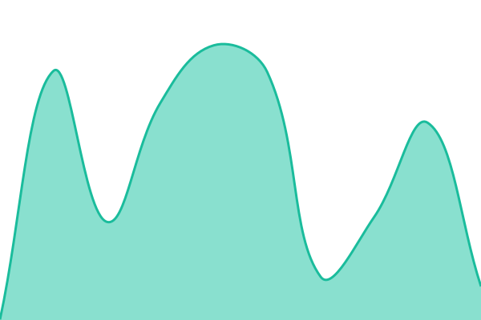 290ms
     
 | 

<a href="https://MerchantsBonding.github.io/upptime/history/credit-puller">92.63%</a>
    

|  [Event History](https://event-history.merchantsbonding.com/up) | 🟩 Up | [event-history.yml](https://github.com/MerchantsBonding/upptime/commits/HEAD/history/event-history.yml) | 

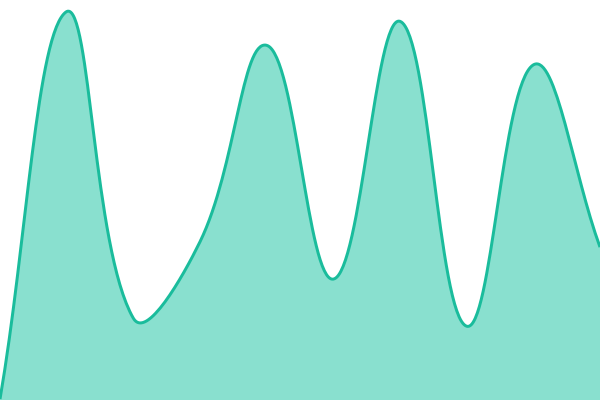 246ms
     
 | 

<a href="https://MerchantsBonding.github.io/upptime/history/event-history">92.63%</a>
    

|  [Headmaster](https://headmaster.merchantsbonding.com/up) | 🟩 Up | [headmaster.yml](https://github.com/MerchantsBonding/upptime/commits/HEAD/history/headmaster.yml) | 

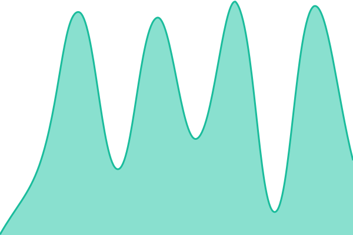 277ms
     
 | 

<a href="https://MerchantsBonding.github.io/upptime/history/headmaster">92.63%</a>
    

|  [Hubble](https://hub.merchantsbonding.com/up) | 🟩 Up | [hubble.yml](https://github.com/MerchantsBonding/upptime/commits/HEAD/history/hubble.yml) | 

 243ms
     
 | 

<a href="https://MerchantsBonding.github.io/upptime/history/hubble">92.63%</a>
    

|  [HubExpress](https://hubexpress.merchantsbonding.com/up) | 🟩 Up | [hub-express.yml](https://github.com/MerchantsBonding/upptime/commits/HEAD/history/hub-express.yml) | 

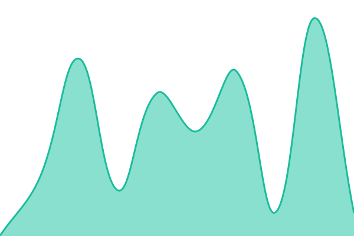 295ms
     
 | 

<a href="https://MerchantsBonding.github.io/upptime/history/hub-express">92.63%</a>
    

|  [MBC](https://secure2.merchantsbonding.com/up) | 🟩 Up | [mbc.yml](https://github.com/MerchantsBonding/upptime/commits/HEAD/history/mbc.yml) | 

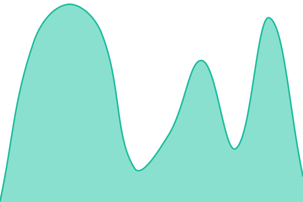 258ms
     
 | 

<a href="https://MerchantsBonding.github.io/upptime/history/mbc">92.63%</a>
    

|  [Navvy](https://navigator.merchantsbonding.com/up) | 🟩 Up | [navvy.yml](https://github.com/MerchantsBonding/upptime/commits/HEAD/history/navvy.yml) | 

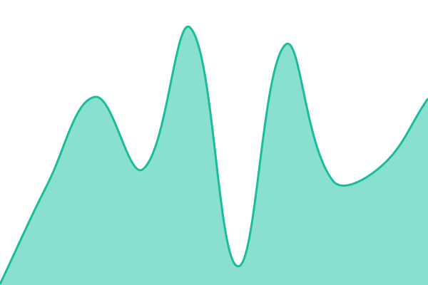 225ms
     
 | 

<a href="https://MerchantsBonding.github.io/upptime/history/navvy">92.63%</a>
    

|  [Piedpiper](https://pay.merchantsbonding.com/up) | 🟩 Up | [piedpiper.yml](https://github.com/MerchantsBonding/upptime/commits/HEAD/history/piedpiper.yml) | 

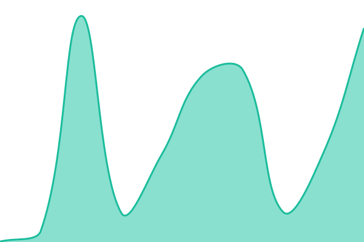 297ms
     
 | 

<a href="https://MerchantsBonding.github.io/upptime/history/piedpiper">92.64%</a>
    

|  [PDF Helper](https://pdfhelper.merchantsbonding.com/up) | 🟩 Up | [pdf-helper.yml](https://github.com/MerchantsBonding/upptime/commits/HEAD/history/pdf-helper.yml) | 

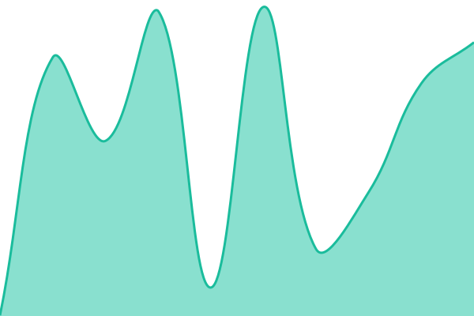 288ms
     
 | 

<a href="https://MerchantsBonding.github.io/upptime/history/pdf-helper">92.64%</a>
    

|  [Skyfall](https://skyfall.merchantsbonding.com/up) | 🟩 Up | [skyfall.yml](https://github.com/MerchantsBonding/upptime/commits/HEAD/history/skyfall.yml) | 

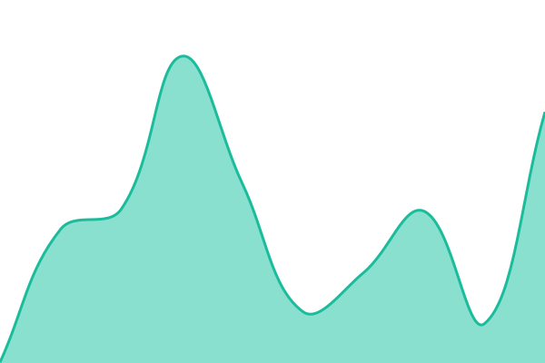 224ms
     
 | 

<a href="https://MerchantsBonding.github.io/upptime/history/skyfall">92.64%</a>
    

|  [Undertaker](https://underwriting.merchantsbonding.com/up) | 🟩 Up | [undertaker.yml](https://github.com/MerchantsBonding/upptime/commits/HEAD/history/undertaker.yml) | 

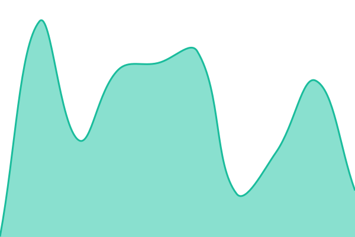 236ms
     
 | 

<a href="https://MerchantsBonding.github.io/upptime/history/undertaker">92.64%</a>
    

|  [Rating Engine](https://rating-engine.merchantsbonding.com/up) | 🟩 Up | [rating-engine.yml](https://github.com/MerchantsBonding/upptime/commits/HEAD/history/rating-engine.yml) | 

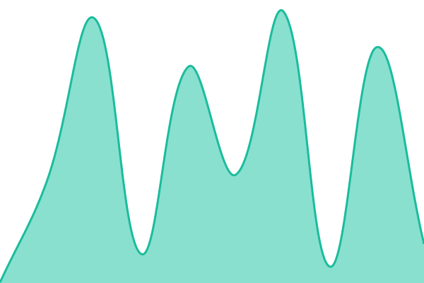 270ms
     
 | 

<a href="https://MerchantsBonding.github.io/upptime/history/rating-engine">92.64%</a>
    

|  [API (Staging)](https://api.mbctestweb.com/up) | 🟩 Up | [api-staging.yml](https://github.com/MerchantsBonding/upptime/commits/HEAD/history/api-staging.yml) | 

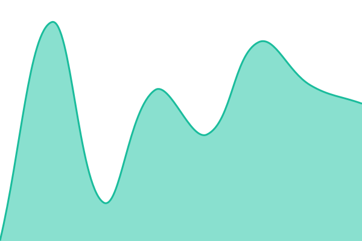 309ms
     
 | 

<a href="https://MerchantsBonding.github.io/upptime/history/api-staging">100.00%</a>
    

|  [Beancounter (Staging)](https://beancounter.mbctestweb.com/up) | 🟩 Up | [beancounter-staging.yml](https://github.com/MerchantsBonding/upptime/commits/HEAD/history/beancounter-staging.yml) | 

 663ms
     
 | 

<a href="https://MerchantsBonding.github.io/upptime/history/beancounter-staging">92.63%</a>
    

|  [Commish (Staging)](https://commish.mbctestweb.com/up) | 🟩 Up | [commish-staging.yml](https://github.com/MerchantsBonding/upptime/commits/HEAD/history/commish-staging.yml) | 

 296ms
     
 | 

<a href="https://MerchantsBonding.github.io/upptime/history/commish-staging">100.00%</a>
    

|  [Contract Rating (Staging)](https://rates.mbctestweb.com/up) | 🟩 Up | [contract-rating-staging.yml](https://github.com/MerchantsBonding/upptime/commits/HEAD/history/contract-rating-staging.yml) | 

 280ms
     
 | 

<a href="https://MerchantsBonding.github.io/upptime/history/contract-rating-staging">92.64%</a>
    

|  [Credit Puller (Staging)](https://credit-puller.mbctestweb.com/up) | 🟩 Up | [credit-puller-staging.yml](https://github.com/MerchantsBonding/upptime/commits/HEAD/history/credit-puller-staging.yml) | 

 299ms
     
 | 

<a href="https://MerchantsBonding.github.io/upptime/history/credit-puller-staging">100.00%</a>
    

|  [Event History (Staging)](https://event-history.mbctestweb.com/up) | 🟩 Up | [event-history-staging.yml](https://github.com/MerchantsBonding/upptime/commits/HEAD/history/event-history-staging.yml) | 

 324ms
     
 | 

<a href="https://MerchantsBonding.github.io/upptime/history/event-history-staging">92.64%</a>
    

|  [Headmaster (Staging)](https://headmaster.mbctestweb.com/up) | 🟩 Up | [headmaster-staging.yml](https://github.com/MerchantsBonding/upptime/commits/HEAD/history/headmaster-staging.yml) | 

 309ms
     
 | 

<a href="https://MerchantsBonding.github.io/upptime/history/headmaster-staging">92.63%</a>
    

|  [Hubble (Staging)](https://hub.mbctestweb.com/up) | 🟩 Up | [hubble-staging.yml](https://github.com/MerchantsBonding/upptime/commits/HEAD/history/hubble-staging.yml) | 

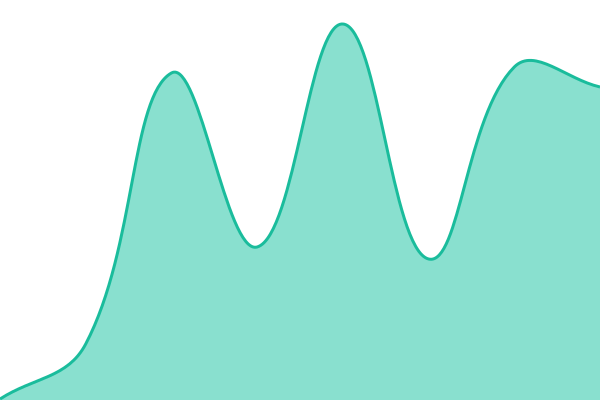 254ms
     
 | 

<a href="https://MerchantsBonding.github.io/upptime/history/hubble-staging">92.64%</a>
    

|  [HubExpress (Staging)](https://hubexpress.mbctestweb.com/up) | 🟩 Up | [hub-express-staging.yml](https://github.com/MerchantsBonding/upptime/commits/HEAD/history/hub-express-staging.yml) | 

 287ms
     
 | 

<a href="https://MerchantsBonding.github.io/upptime/history/hub-express-staging">100.00%</a>
    

|  [MBC (Staging)](https://secure2.mbctestweb.com/up) | 🟩 Up | [mbc-staging.yml](https://github.com/MerchantsBonding/upptime/commits/HEAD/history/mbc-staging.yml) | 

 310ms
     
 | 

<a href="https://MerchantsBonding.github.io/upptime/history/mbc-staging">92.63%</a>
    

|  [Navvy (Staging)](https://navigator.mbctestweb.com/up) | 🟩 Up | [navvy-staging.yml](https://github.com/MerchantsBonding/upptime/commits/HEAD/history/navvy-staging.yml) | 

 199ms
     
 | 

<a href="https://MerchantsBonding.github.io/upptime/history/navvy-staging">100.00%</a>
    

|  [Piedpiper (Staging)](https://pay.mbctestweb.com/up) | 🟩 Up | [piedpiper-staging.yml](https://github.com/MerchantsBonding/upptime/commits/HEAD/history/piedpiper-staging.yml) | 

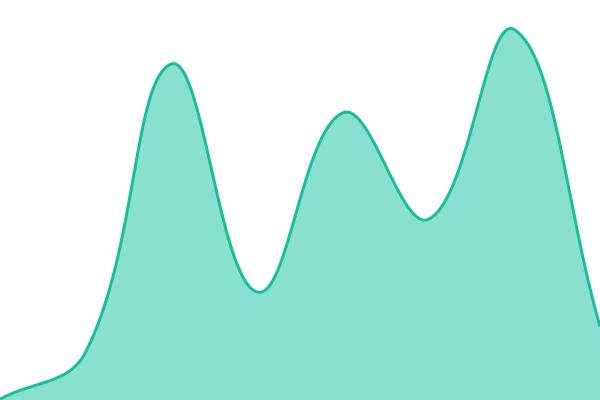 273ms
     
 | 

<a href="https://MerchantsBonding.github.io/upptime/history/piedpiper-staging">100.00%</a>
    

|  [PDF Helper (Staging)](https://pdfhelper.mbctestweb.com/up) | 🟩 Up | [pdf-helper-staging.yml](https://github.com/MerchantsBonding/upptime/commits/HEAD/history/pdf-helper-staging.yml) | 

 1613ms
     
 | 

<a href="https://MerchantsBonding.github.io/upptime/history/pdf-helper-staging">92.63%</a>
    

|  [Skyfall (Staging)](https://skyfall.mbctestweb.com/up) | 🟩 Up | [skyfall-staging.yml](https://github.com/MerchantsBonding/upptime/commits/HEAD/history/skyfall-staging.yml) | 

 204ms
     
 | 

<a href="https://MerchantsBonding.github.io/upptime/history/skyfall-staging">100.00%</a>
    

|  [Undertaker (Staging)](https://underwriting.mbctestweb.com/up) | 🟩 Up | [undertaker-staging.yml](https://github.com/MerchantsBonding/upptime/commits/HEAD/history/undertaker-staging.yml) | 

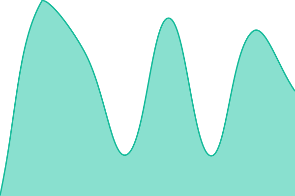 242ms
     
 | 

<a href="https://MerchantsBonding.github.io/upptime/history/undertaker-staging">100.00%</a>
    

|  [Rating Engine (Staging)](https://rating-engine.mbctestweb.com/up) | 🟩 Up | [rating-engine-staging.yml](https://github.com/MerchantsBonding/upptime/commits/HEAD/history/rating-engine-staging.yml) | 

 266ms
     
 | 

<a href="https://MerchantsBonding.github.io/upptime/history/rating-engine-staging">100.00%</a>
    

<!--end: status pages-->

[**Visit our status website →**](https://merchantsbonding.com)

## 📄 License

- Powered by: [Upptime](https://github.com/upptime/upptime)
- Code: [MIT](./LICENSE) © [Anand Chowdhary](https://anandchowdhary.com), supported by [Pabio](https://pabio.com)
- Data in the `./history` directory: [Open Database License](https://opendatacommons.org/licenses/odbl/1-0/)
